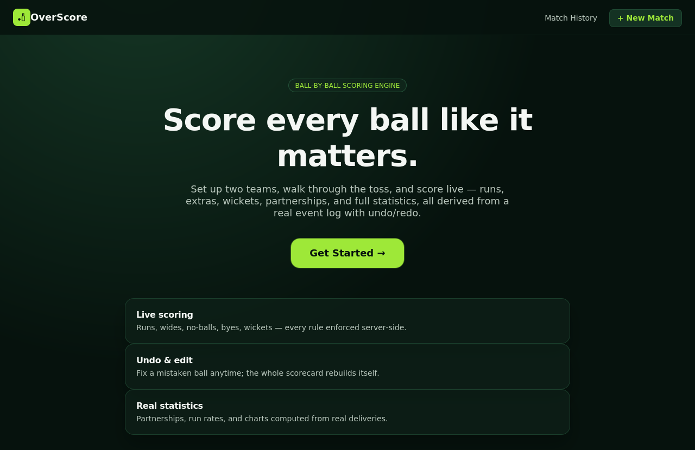
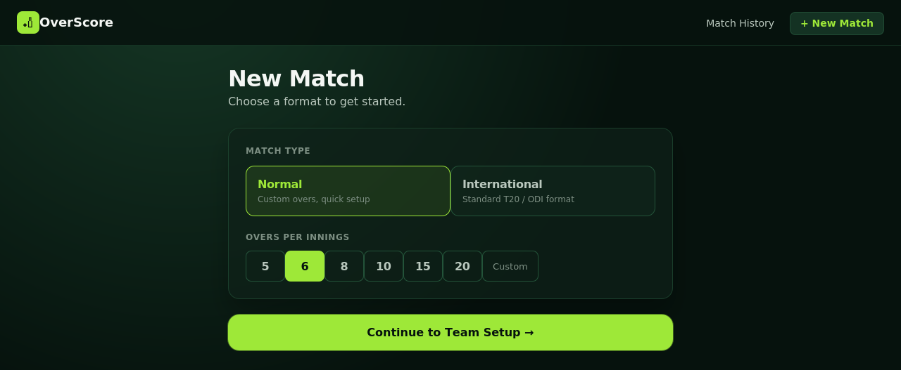
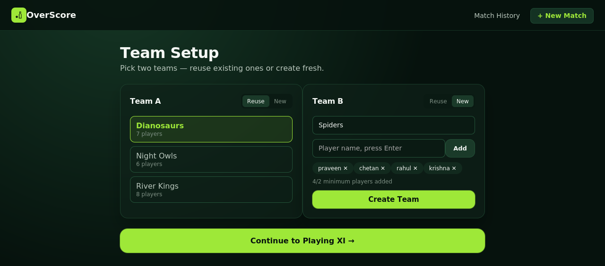
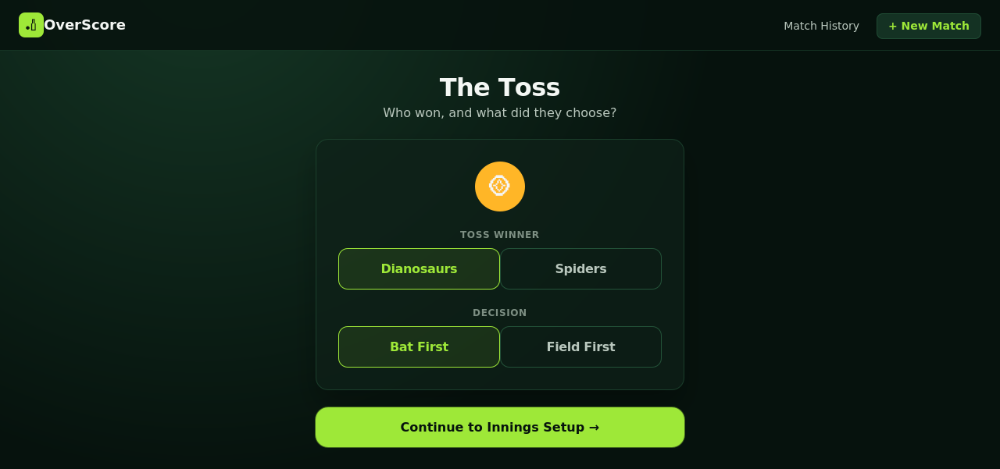
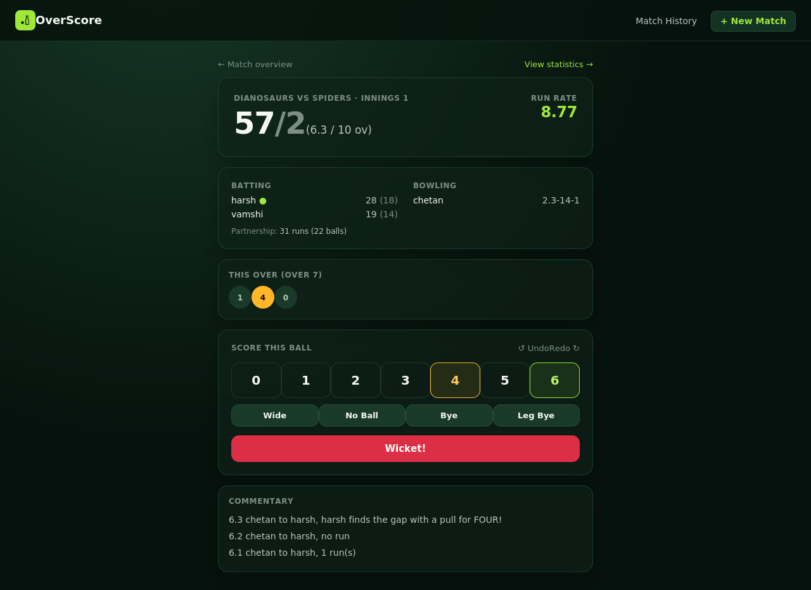
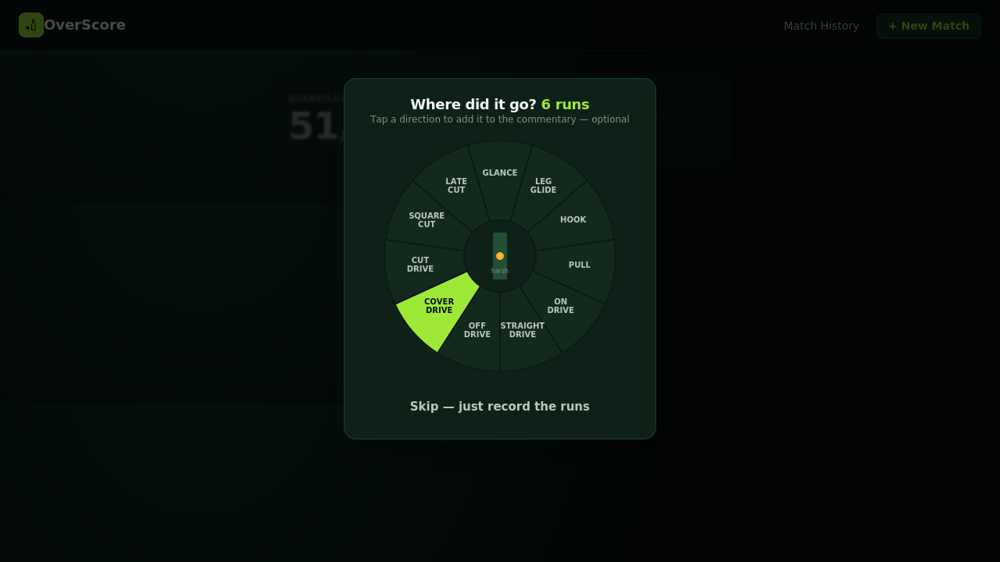
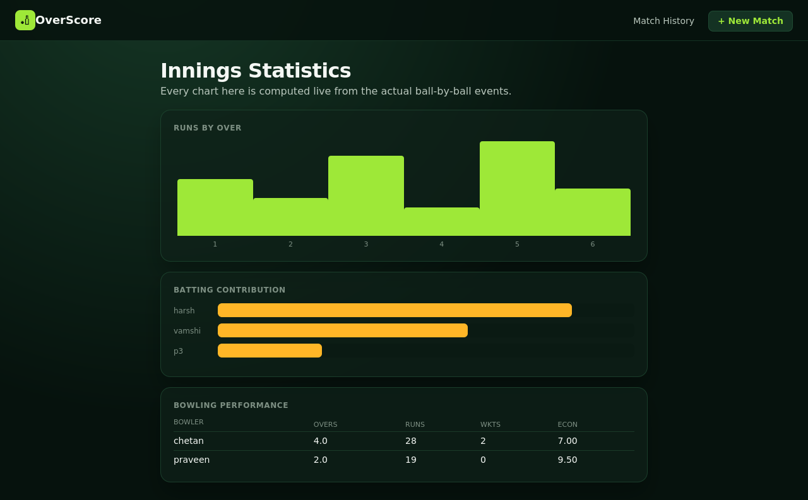
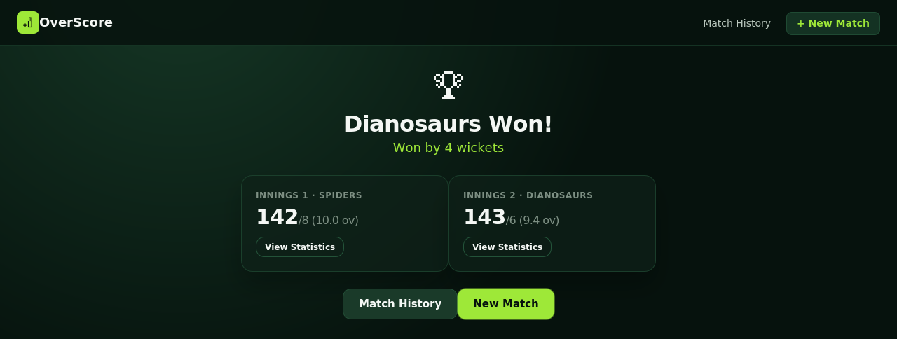
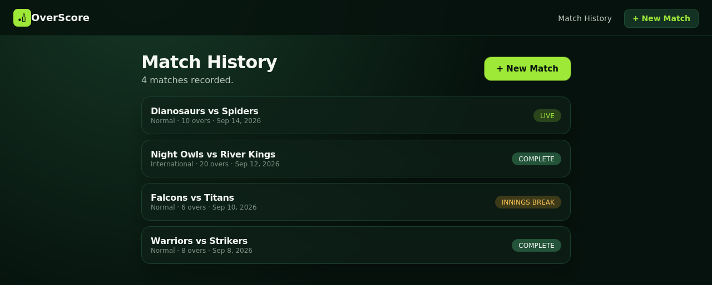

<div align="center">



# Hi 👋, I'm Gunda Tejeswara Rao


<br/>

[](https://github.com/gundatejeswararao7)
[](https://www.linkedin.com/in/g-tejeswara-rao-b0bb882b7)
[](mailto:gundatejeswararao7@gmail.com)
[](https://leetcode.com/u/G_TEJESWARA_RAO_07/)
[](https://drive.google.com/file/d/1b33Aig4MJOvNFMrB0XJX-Z78ALXB0VNj/view?usp=sharing)


</div>

---

## 🧑‍💻 About Me

- 🎓 Student at **MVSR Engineering College**
- 📍 Nadergul, Hyderabad, Telangana
- 🚀 Building practical, scalable, and secure software systems
- 🤖 Exploring **AI, Agentic AI**, and automation tools like **n8n** and **Make**
- ☁️ Interested in **Cloud, AWS, Cybersecurity, IoT & Embedded Systems**
- 💡 I enjoy turning ideas into complete projects — from backend APIs and databases to responsive frontends and real-time systems
- 🔐 Member of **CICADA-3301 Cyber Security Club**, MVSR Engineering College

---

## 🛠️ Tech Stack

**Languages**

      

**Full-Stack Development**

    

**Databases**

 

**Cloud, DevOps & Tools**

    

**Cybersecurity**


**IoT & Embedded**

  

---

## ⭐ Featured Projects

### 💼 [Workfolio](https://github.com/gundatejeswararao7/Workfolio)
**Post Work. Find Work. Get It Done.**
A flexible temporary job marketplace where anyone can post work and anyone can find work — connecting people for technical and non-technical tasks, with users able to switch between requester and worker roles.
`React` `Python` `FastAPI`

### 🏏 [OverScore — Full-Stack Cricket Scoring Application](https://github.com/gundatejeswararao7/Cricket)
A full-stack cricket scoring app for complete ball-by-ball match management — teams, players, playing XI, toss, innings, runs, wickets, extras, overs, strike rotation, targets, match results, and history. Uses an append-only event-based architecture for reliable score calculation, statistics, commentary, and undo/redo.
`React` `Python` `FastAPI` `PostgreSQL` `REST APIs`

<details>
<summary><b>📸 View screenshots</b></summary>
<br>

<table>
<tr>
<td width="50%"><p align="center"><sub>Landing page</sub></p></td>
<td width="50%"><p align="center"><sub>New match setup</sub></p></td>
</tr>
<tr>
<td width="50%"><p align="center"><sub>Team setup</sub></p></td>
<td width="50%"><p align="center"><sub>The toss</sub></p></td>
</tr>
<tr>
<td width="50%"><p align="center"><sub>Live ball-by-ball scorer</sub></p></td>
<td width="50%"><p align="center"><sub>Shot placement map</sub></p></td>
</tr>
<tr>
<td width="50%"><p align="center"><sub>Live-computed statistics dashboard</sub></p></td>
<td width="50%"><p align="center"><sub>Match result</sub></p></td>
</tr>
<tr>
<td width="50%"><p align="center"><sub>Match history</sub></p></td>
<td width="50%"></td>
</tr>
</table>

</details>

### ⚡ [EcoVolt — Secure IoT Smart Energy Meter](https://github.com/gundatejeswararao7/EcoVolt-Smart-Sustainable-Energy)
An IoT-powered smart energy monitoring and billing system that tracks electricity consumption in real time, analyzes usage patterns, controls electrical loads, and delivers insights through a web dashboard.
`ESP32` `IoT` `Arduino IDE` `React` `Node.js` `Express.js` `MongoDB`

### 🕶️ [ShadowChat](https://github.com/gundatejeswararao7/ShadowChat)
A command-line-only, temporary, one-to-one encrypted chat system built for private conversations, with OTP verification, authenticated sessions, AES-256-GCM message encryption, and automatic room cleanup.
`Bash` `Python` `FastAPI` `PostgreSQL` `AES-256-GCM`

<details>
<summary><b>📸 View screenshots</b></summary>
<br>

<table>
<tr>
<td width="50%"><p align="center"><sub>Landing menu</sub></p></td>
<td width="50%"><p align="center"><sub>Registration with email OTP</sub></p></td>
</tr>
<tr>
<td width="50%"><p align="center"><sub>Authenticated login</sub></p></td>
<td width="50%"><p align="center"><sub>Main dashboard</sub></p></td>
</tr>
<tr>
<td width="50%"><p align="center"><sub>Search user &amp; send private chat request</sub></p></td>
<td width="50%"><p align="center"><sub>Accepting a chat invitation</sub></p></td>
</tr>
<tr>
<td width="50%"><p align="center"><sub>Encrypted private room &amp; auto cleanup on leave</sub></p></td>
<td width="50%"></td>
</tr>
</table>

</details>

---

## 💼 Internship Experience

| Organization | Role | Duration |
|---|---|---|
| Elevate Labs | Cybersecurity Intern | Sep 2025 – Nov 2025 |
| Emertxe Information Technologies | IoT Intern | Mar 2026 – Apr 2026 |
| WSA | MERN Stack Development Intern | Mar 2026 – Apr 2026 |

---

## 📜 Certifications

- 🐍 Python — YBI Foundation
- 🗄️ MySQL — Oracle
- 🛡️ Cybersecurity Educator Professional — Red Team Leaders
- 🔐 API Security — Wallarm
- 🐧 Linux — Cisco Networking Academy
- 🤖 Training in AI tools for building agentic agents, including n8n and Make

---

## 🏆 Achievements

- 🥇 Hackathon Winner — CMR College, 2025
- 🏅 15th Position — ByteBattle nationwide coding contest by CodeStrike Community
- 💻 511+ problems solved on LeetCode — Global Rank 201,367 (Easy 314 · Medium 186 · Hard 11)
- 🤖 Completed training in AI tools for building agentic agents
- 🔐 Member of CICADA-3301 Cyber Security Club, MVSR Engineering College

---

## 📊 GitHub Stats

<div align="center">


<br/>


</div>

---

## 📈 My Developer Journey

```
                 FULL-STACK DEVELOPMENT
                         │
          ┌──────────────┼──────────────┐
          ▼              ▼              ▼
       React          Python          Node.js
          │           FastAPI            │
          └──────────────┬───────────────┘
                         ▼
                 CLOUD & DEVOPS
                         │
                  AWS • Docker • Linux
                         │
                         ▼
                 INTELLIGENT SYSTEMS
                         │
              AI • Agentic AI • Automation
                         │
                         ▼
                 CONNECTED SYSTEMS
                         │
               IoT • ESP32 • Embedded
                         │
                         ▼
                  SECURE ENGINEERING
                         │
                    Cybersecurity
```

---

## 📫 Let's Connect

<div align="center">

[](https://www.linkedin.com/in/g-tejeswara-rao-b0bb882b7)
[](https://leetcode.com/u/G_TEJESWARA_RAO_07/)
[](mailto:gundatejeswararao7@gmail.com)
[](https://drive.google.com/file/d/1b33Aig4MJOvNFMrB0XJX-Z78ALXB0VNj/view?usp=sharing)

**💭 Building. Learning. Securing. Automating.**

Thanks for visiting my profile! ⭐


</div>
